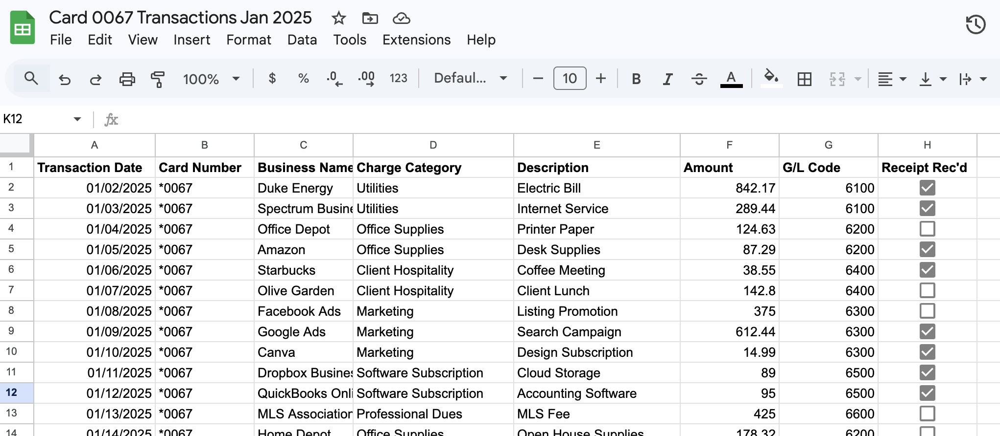

# Financial Reconciliation System Redesign (Case Study)

## Overview

This project documents a credit card reconciliation process I redesigned while working at a real estate brokerage with roughly 25 active cardholders.

The original workflow was mostly manual and paper-based. It worked, but it was slow, inconsistent, and created a lot of extra follow-up each month — especially around missing receipts and G/L coding.

I restructured the process to introduce standardized spreadsheets, clearer folder organization, and batch-ready transaction files. The goal at the time wasn’t automation — it was control, clarity, and efficiency.

---

## Workflow Comparison

The diagram above shows the legacy manual process compared to the revised structured system.

---

## Business Context

Each month involved:

- Hundreds of credit card transactions  
- 25 individual cardholders  
- 50–75 missing receipts per cycle  
- Manual transaction entry into the accounting system  

Transactions included utilities, office supplies, marketing expenses, client lunches, software subscriptions, and professional dues.

Every charge needed to be matched with a receipt, assigned a G/L code, and entered into the accounting platform.

---

## Structured Spreadsheet Design

The redesigned spreadsheet introduced:

- Standardized column schema
- Predefined charge categories
- G/L code mapping
- Receipt tracking checkbox
- Consistent formatting across all cardholders

This reduced variability and simplified reconciliation.

---

## Folder Architecture

A centralized folder structure was implemented:

- Card-level segregation
- Year-based organization
- Statement-period subfolders
- Receipt traceability aligned with transaction periods

This reduced lost documentation and improved compliance.

---

## Measured Improvements

After implementing the revised system:

- Manual transaction entry workload was significantly reduced  
- Receipt compliance improved  
- G/L coding became consistent across all users  
- Transactions could be batch imported instead of entered one by one  
- Reconciliation cycle time was reduced by roughly 50%  

---

## If I Were to Automate This Today

If I were building this system now using modern automation and AI tools, I would extend it by:

- Using OCR to extract receipt data automatically  
- Applying AI-based receipt matching against transaction feeds  
- Automatically flagging missing receipts prior to statement close  
- Using rule-based or LLM-assisted classification to suggest G/L codes  
- Building a reconciliation dashboard for real-time status tracking  
- Triggering automated reminders for outstanding documentation  

The structured redesign implemented here laid the foundation for that type of automation by normalizing data, standardizing categories, and introducing consistent logic.

---

## Why This Project Matters

Although this project predates my formal AI training, it reflects the same systems thinking principles:

- Normalize the data  
- Standardize the schema  
- Apply logic consistently  
- Design for batch processing  
- Reduce unnecessary manual friction  

These principles are foundational to automation and AI-enabled workflow design.

---

## Notes

All data shown here is anonymized and recreated for demonstration purposes.
